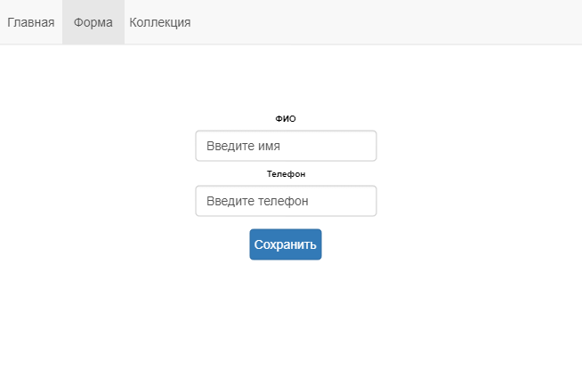

## Тестовое задание для ООО Геограком

Вам необходимо разработать SPA приложение выполнив ниже перечисленные требования.

### Первая часть (реализация без использования внешнего хранилища и Redux)

- Сделать clone http://gitlab.com/interview/geogracom-test-app.git
- Создать локальную ветку git part-1;
- Сделать четыре страницы: "Главная", "Форма", "Коллекция" и "Страница не найдена";
- При работе со стилями можно использовать любую известную вам библиотеку или же обойтись голым CSS;
- На странице "Главная" выводится приветственное сообщение; 
- На странице "Форма" у пользователя есть возможность добавить имя пользователя и его телефон:
  * В поле ФИО пользователь вводит строку или пустое значение. Слова разделяются тире или нижним подчеркиванием, то вводят в виде "имя-фамилия-отчество", "имя_Фамилия-отчество", "Имя_фамилия_Отчество" и т.д.; 
  * В поле телефон пользователь вводит 10 цифр или пустое значение;
  * Ввод валидировать не нужно, считается что пользователь вводит всё в правильном формате;
  * При нажатии на кнопку нужно сохранить оба поля в коллекцию выполнив следующие функции:
    * Необходимо реализовать функцию toCamelCase (/src/utils/toCamelCase.js), чтобы она возвращала строку в формате [Camel Case](https://ru.wikipedia.org/wiki/CamelCase) и заменила все тире/подчеркивания на пробел перед сохранением ФИО в коллекцию;
    * Необходимо реализовать функцию toPhoneNumber (/src/utils/toPhoneNumber.js), чтобы она возвращала введенный телефон в виде "7 (xxx) xxx-xxxx" перед сохранением в коллекцию;
- На странице "Просмотр коллекции" выводятся все добавленные через страницу "Форма" записи с возможностью их удаления при нажатии на элемент;
- Если пользователь ввёл в адресной строке неправильный URL, то он переходит на 404 страницу;
- Сделать commit/push в СВОЙ общедоступный репозитарий.

### Вторая часть (реализация с помощью Redux, по желанию Redux-Thunk)
- Создать ветку git part-2;
- Подключить Redux в приложение;
- Перенести всю логику в Redux;
- Сделать commit/push в СВОЙ общедоступный репозитарий;
- Сделать merge в ветку master и push в СВОЙ общедоступный репозитарий.

### Пример

